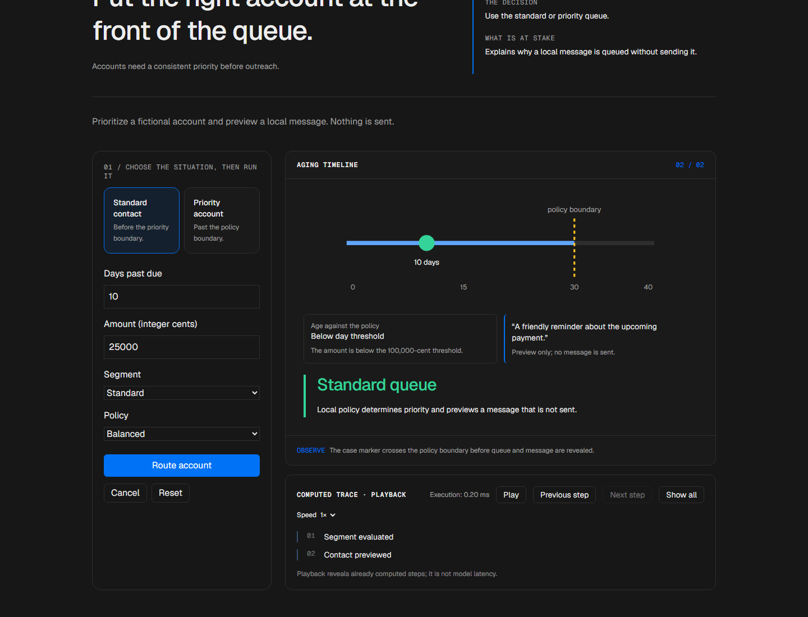
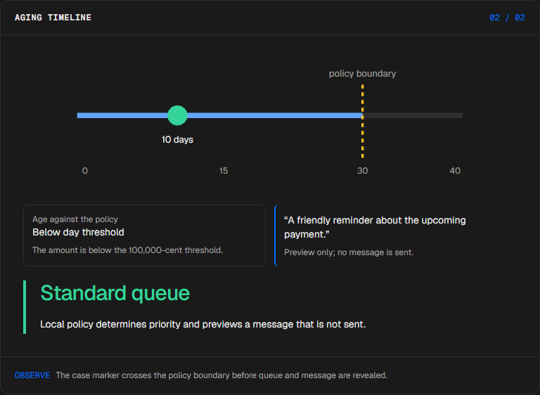
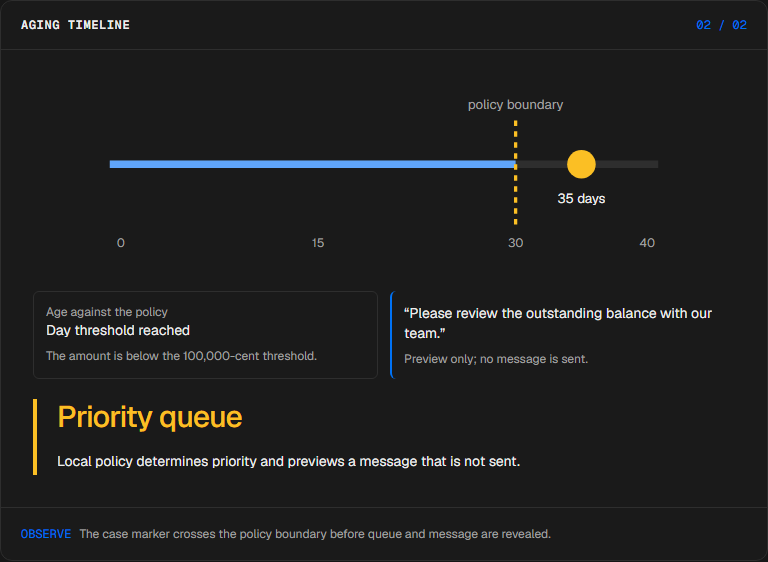
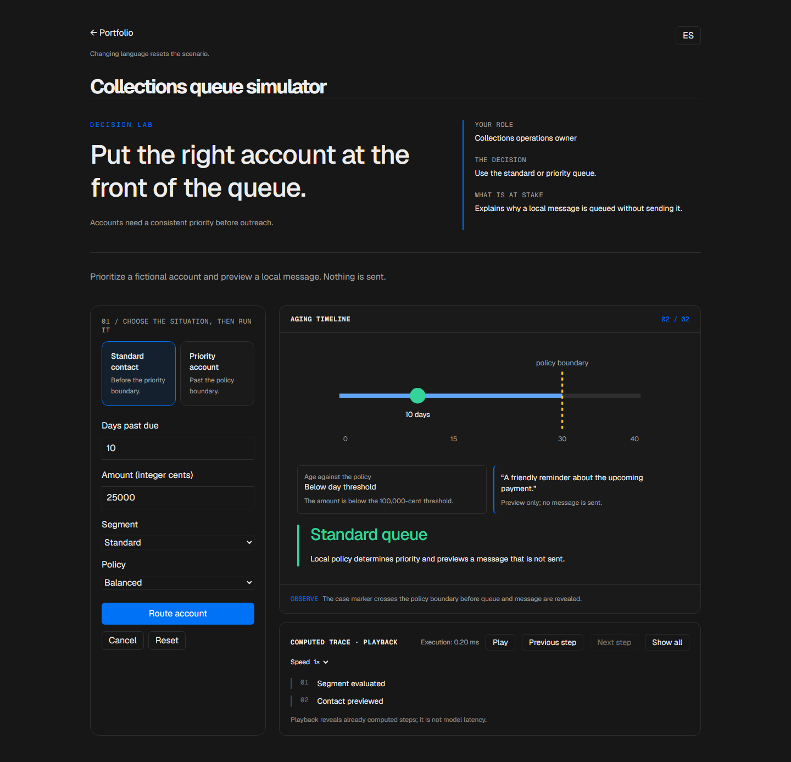

# Collections prioritization

<!-- community-badges -->
[](https://github.com/mdeasis27/agente-cobranzas/actions/workflows/ci.yml) [](LICENSE)
<!-- /community-badges -->

[Español](README.es.md) · [Try the demo](https://agente-cobranzas-manueldeasis27-2515s-projects.vercel.app/en/app) · [Case study](https://manueldeasis.com/en/projects/agente-cobranzas) · [Source](https://github.com/mdeasis27/agente-cobranzas)



Change overdue days, amount in integer cents, segment and contact rules.

## Two situations to compare

**Standard contact:** 10 days past due, balanced policy The account remains in the standard queue.



**Priority account:** 35 days past due, balanced policy The case crosses the policy boundary and becomes priority.



## Business use case

Accounts need a consistent priority before outreach.

**Who uses it:** Collections operations owner.

**The decision:** Use the standard or priority queue.

Place an account on the aging timeline, apply the policy boundary, then preview the route.

### Try the decision

**Standard contact:** 10 days past due, balanced policy The account remains in the standard queue.

**Priority account:** 35 days past due, balanced policy The case crosses the policy boundary and becomes priority.

Choose a scenario, edit its controls and run the local computation. Step through the visual process or reveal all steps. Reset before comparing the second scenario.

## How to try it

Open `/en/app` (English, default) or `/es/app` (Spanish). Change the scenario inputs and run the computation. Inspect the resulting decision, evidence and computed trace. Playback reveals completed local steps; it does not measure a live model. Reset starts a new local scenario. Changing language resets the scenario; the interface displays a reset notice.

The primary demo needs no account, API key or database. Public links refer to the existing deployment; local redesign changes are pending publication.

## Local setup and verification

Requires Node.js 22 and pnpm 10.

```sh
pnpm install --frozen-lockfile
pnpm dev
pnpm test
node node_modules/typescript/bin/tsc --noEmit --incremental false
pnpm lint
pnpm build
```

Open `http://localhost:3000/en/app`. Recorded validation covers tests, lint, TypeScript and production builds. See [command results](docs/quality/decision-lab-verification.json) and [browser component checks](docs/quality/decision-lab-browser.json). The new browser checks exercise real React components and production CSS with controlled locale navigation; they do not certify Next routes or public deployment.

## Architecture

- `app/[lang]/`: localized browser experience.
- `lib/experience/`: typed local adapter, validation and run traces.
- `design-system/`: shared visual tokens, locale controls and execution/replay presentation.
- `app/api/`: optional server integrations; the primary demo does not require them.

Technology: Next.js 16, TypeScript, PostgreSQL, Drizzle ORM, LLM API, Messaging Bot API, Scheduled jobs, Tailwind CSS v4.

## Evidence and limitations

An aging timeline shows the case marker crossing the policy boundary.

Queue segmentation and a message preview; no message is sent.

Explains why a local message is queued without sending it.

**Limits:** Messages are local previews and are never sent. These portfolio prototypes do not claim measured production impact.

Inputs use fictional or anonymized examples. Optional live integrations require their own credentials and operational setup. Secrets belong in the configured secret manager, never in local secret files or Git. Use the existing `infisical run -- <command>` workflow when live integration is needed. This repository does not publish or deploy automatically as part of the local demo.



<!-- community-section -->
## License and contributing

Released under the [MIT License](LICENSE). Issues and pull requests are welcome: read [CONTRIBUTING.md](CONTRIBUTING.md) and the [Code of Conduct](CODE_OF_CONDUCT.md) first. To report a vulnerability, see [SECURITY.md](SECURITY.md).
<!-- /community-section -->
